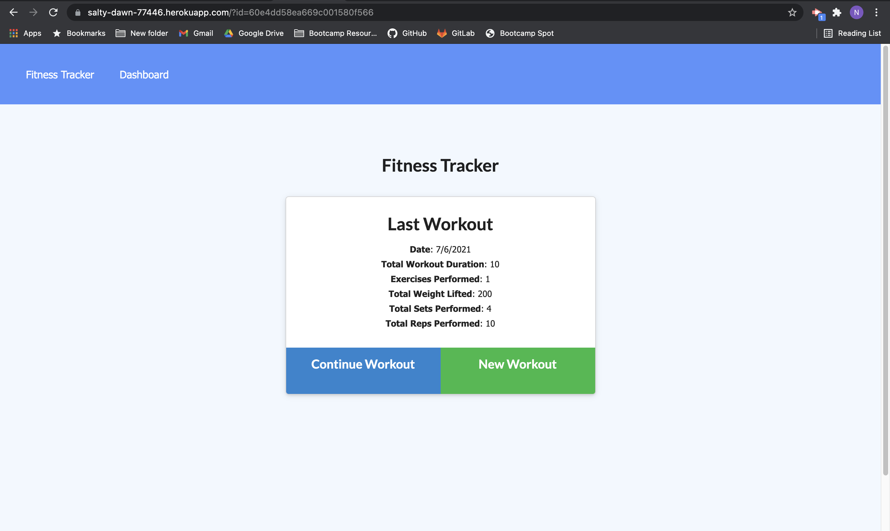

# Fitness Tracker 

---

## Description 

[Fitness Tracker](https://salty-dawn-77446.herokuapp.com/) is an app that allows users to view create and track daily workouts. The user can log multiple exercises in a workout on a given day, track the name, type, weight, sets, reps, and duration of exercise, and if the exercise is a cardio exercise, users can track distance traveled.

---

### Credits
[Nelson Johns](https://github.com/ntjohns1)

---

## Technologies Used
* [Node.js](https://nodejs.org/en/docs/)
* [express](http://expressjs.com/en/api.html)
* [MongoDB](https://www.mongodb.com/)
* [Mongoose](https://mongoosejs.com/)

---

## Usage
Deployed link: https://salty-dawn-77446.herokuapp.com//  
Github Repo Link: https://github.com/ntjohns1/Fitness-Tracker

---

## Badges

 

 

 

 

---

## License

 

